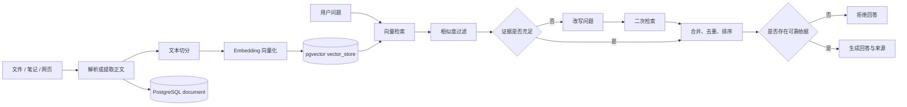

# Knowledge Base Build

一个基于 Spring Boot、Spring AI、PostgreSQL 与 pgvector 的个人知识库系统。系统支持收录文件、笔记和公开网页，将正文解析、切分、向量化后写入知识库，并通过带来源追踪的两阶段 RAG 流程回答问题。

## 核心能力

- 支持 PDF、TXT、Markdown、DOCX 四种文件解析。
- 支持直接创建文本笔记。
- 支持抓取公开 HTTP/HTTPS 网页正文，并限制内网访问、响应大小和超时。
- 文本按段落切分，支持块大小限制、相邻块重叠和超长段落硬切。
- 使用 Spring AI 与 PostgreSQL pgvector 保存、检索向量。
- 首次检索证据不足时，使用模型改写问题并进行二次检索。
- 无可靠依据时拒绝回答；有依据时返回答案、来源片段、相似度和检索轨迹。
- 支持资料列表、重新入库和删除，向量数据随资料同步更新。
- 提供统一 JSON 异常响应、OpenAPI 文档和单页前端。

## 业务流程



## 技术栈

| 类型 | 技术 |
|---|---|
| 基础框架 | Spring Boot 4.1.1、Java 17 |
| Web | Spring Web MVC、Jakarta Validation |
| 数据访问 | Spring Data JPA、PostgreSQL JDBC |
| AI | Spring AI 2.0.1、OpenAI 兼容接口 |
| 向量存储 | PostgreSQL、pgvector、HNSW、余弦距离 |
| 文档解析 | PDFBox 3.0.3、Apache POI 5.4.0 |
| 网页解析 | Jsoup 1.18.3、Java HttpClient |
| API 文档 | SpringDoc OpenAPI 3.1.0 |
| 测试 | JUnit 5、AssertJ、Mockito |

当前模型配置使用 SiliconFlow 的 OpenAI 兼容接口：

- Embedding：`BAAI/bge-m3`
- Chat：`Qwen/Qwen3-8B`
- 向量维度：`1024`

## 快速开始

### 1. 环境要求

- JDK 17 或更高版本。
- Maven 3.9+。
- PostgreSQL 14+。
- 已安装 pgvector 扩展。
- 可用的 SiliconFlow API Key。

### 2. 初始化数据库

```sql
CREATE DATABASE knowledge_base_rebuild;
```

连接到新数据库后启用扩展：

```sql
CREATE EXTENSION IF NOT EXISTS vector;
```

应用首次启动时会根据配置自动维护 `document` 表，并初始化 `public.vector_store`。

### 3. 配置 `.env`

复制示例文件：

```powershell
Copy-Item .env.example .env
```

确保 `.env` 至少包含以下变量：

```properties
DB_URL=jdbc:postgresql://localhost:5432/knowledge_base_rebuild
DB_USERNAME=postgres
DB_PASSWORD=replace-with-your-database-password
SILICONFLOW_API_KEY=replace-with-your-siliconflow-api-key
```

`.env` 已被 Git 忽略。不要把真实数据库密码或 API Key 写入 `application.yaml`、README 或提交历史。

### 4. 启动应用

```powershell
mvn spring-boot:run
```

启动后访问：

- 前端页面：<http://localhost:8082/>
- Swagger UI：<http://localhost:8082/swagger-ui.html>
- OpenAPI JSON：<http://localhost:8082/v3/api-docs>

### 5. 测试和打包

```powershell
mvn test
mvn package
```

可执行 JAR 位于：

```text
target/knowledge-base-bulid-0.0.1-SNAPSHOT.jar
```

运行 JAR：

```powershell
java -jar target/knowledge-base-bulid-0.0.1-SNAPSHOT.jar
```

## API 概览

| 方法 | 路径 | 功能 |
|---|---|---|
| `POST` | `/api/documents` | 上传 PDF/TXT/MD/DOCX 并入库 |
| `POST` | `/api/documents/notes` | 创建笔记并入库 |
| `POST` | `/api/documents/links` | 抓取公开网页并入库 |
| `GET` | `/api/documents` | 查询全部资料 |
| `PUT` | `/api/documents/{id}` | 使用新文件替换并重新入库 |
| `DELETE` | `/api/documents/{id}` | 删除资料及对应向量 |
| `POST` | `/api/chat` | 基于知识库进行 RAG 问答 |

问答请求示例：

```json
{
  "question": "实验室例会是什么时间？"
}
```

响应包含：

- `answer`：最终回答或无依据拒答信息。
- `sources`：资料 ID、名称、URL、块序号、片段和相似度。
- `retrieval`：原问题、改写问题、是否二次检索、候选数和采纳数。

## 项目结构

```text
src/main/java/com/ithwx/
├── Controller/     REST API 与统一异常处理
├── Dto/            请求、响应和来源追踪对象
├── Entity/         JPA 资料元数据实体
├── Repository/     Spring Data JPA 仓储
└── Service/        解析、切分、抓取、入库和 RAG 服务

src/main/resources/
├── application.yaml
└── static/index.html
```

## 文档

- [项目设计文档](docs/PROJECT_DESIGN.md)
- [模块拆分文档](docs/MODULES.md)
- [运行说明](docs/RUNNING.md)

## 已知边界

- 当前 RAG 单元测试使用 Mock，不会调用真实模型；发布前应进行一次受控的真实入库和问答联调。
- PDF 与 DOCX 已实现解析，但当前自动化测试主要覆盖 TXT、Markdown、大小写扩展名和不支持类型。
- `document` 元数据与 `vector_store` 属于不同写入路径，无法通过单一数据库事务保证跨操作原子性。失败时资料状态会记录为 `FAILED`，生产环境可进一步加入补偿任务。
- 当前使用 Hibernate `ddl-auto: update` 和 Spring AI 自动初始化向量表。生产环境建议改用 Flyway 或 Liquibase 管理结构变更。

