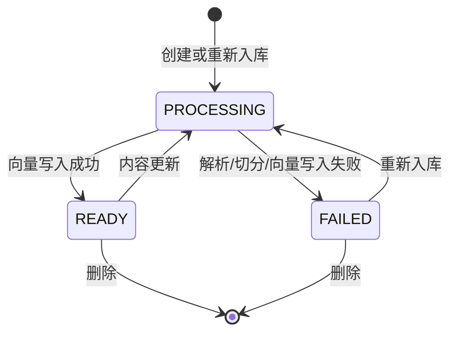

# 模块拆分文档

## 1. 模块总览

项目采用按技术职责分包的单体结构。各模块通过 Spring 构造注入协作，核心依赖方向如下：

```text
Controller
  ├── DocumentService
  │     ├── DocumentParserService
  │     ├── WebContentService
  │     ├── ChunkingService
  │     ├── VectorStore
  │     └── DocumentRepository
  └── ChatService
        ├── VectorStore
        └── ChatModel
```

依赖应保持从接口层流向业务层和数据层，Service 不依赖 Controller，Repository 不承载业务编排。

## 2. 目录结构

```text
src/
├── main/
│   ├── java/com/ithwx/
│   │   ├── Controller/
│   │   │   ├── ChatController.java
│   │   │   ├── DocumentController.java
│   │   │   └── GlobalExceptionHandler.java
│   │   ├── Dto/
│   │   │   ├── ApiError.java
│   │   │   ├── ChatRequest.java
│   │   │   ├── ChatResponse.java
│   │   │   ├── LinkRequest.java
│   │   │   ├── NoteRequest.java
│   │   │   ├── RetrievalTrace.java
│   │   │   └── Source.java
│   │   ├── Entity/
│   │   │   └── DocumentEntity.java
│   │   ├── Repository/
│   │   │   └── DocumentRepository.java
│   │   ├── Service/
│   │   │   ├── ChatService.java
│   │   │   ├── ChunkingService.java
│   │   │   ├── DocumentParserService.java
│   │   │   ├── DocumentService.java
│   │   │   └── WebContentService.java
│   │   └── KnowledgeBaseBulidApplication.java
│   └── resources/
│       ├── application.yaml
│       └── static/index.html
└── test/java/com/ithwx/
    ├── KnowledgeBaseBulidApplicationTests.java
    └── Service/
        ├── ChatServiceTest.java
        ├── ChunkingServiceTest.java
        ├── DocumentParserServiceTest.java
        └── WebContentServiceTest.java
```

## 3. Controller 模块

### 3.1 `DocumentController`

职责：提供资料管理 REST API，不承载解析、切分或索引逻辑。

| 方法 | 路径 | 调用服务 | 说明 |
|---|---|---|---|
| `POST` | `/api/documents` | `DocumentService.ingest` | 上传并入库文件 |
| `POST` | `/api/documents/notes` | `ingestNote` | 新建笔记 |
| `POST` | `/api/documents/links` | `ingestLink` | 抓取并收录网页 |
| `GET` | `/api/documents` | `list` | 查询资料列表 |
| `PUT` | `/api/documents/{id}` | `reingest` | 替换文件并重建向量 |
| `DELETE` | `/api/documents/{id}` | `delete` | 删除资料与向量 |

### 3.2 `ChatController`

职责：接收经过校验的 `ChatRequest`，调用 `ChatService.ask` 并返回 `ChatResponse`。

### 3.3 `GlobalExceptionHandler`

职责：把参数校验、文件大小、业务参数、模型认证及未知异常转换为统一 `ApiError`。

不应在 Controller 内重复捕获这些异常，避免不同接口返回不同错误结构。

## 4. DTO 模块

### 4.1 请求 DTO

| DTO | 字段 | 校验 |
|---|---|---|
| `ChatRequest` | `question` | 非空，最多 2000 字符 |
| `NoteRequest` | `title`、`content` | 均非空；标题 200、正文 200000 字符上限 |
| `LinkRequest` | `url`、`title` | URL 非空且最多 2048；标题最多 200 |

### 4.2 响应 DTO

- `ChatResponse`：答案、来源列表和检索轨迹。
- `Source`：资料 ID、名称、原始 URL、块序号、片段和相似度。
- `RetrievalTrace`：原问题、改写问题、是否重试、候选数和采纳数。
- `ApiError`：时间、HTTP 状态、错误信息和请求路径。

DTO 使用 Java `record`，适合不可变的数据传输结构。

## 5. Service 模块

### 5.1 `DocumentParserService`

职责：根据调用方传入的文件类型提取纯文本。

| 类型 | 实现 |
|---|---|
| PDF | PDFBox `Loader` + `PDFTextStripper` |
| TXT | 按 UTF-8 读取 |
| Markdown | 按 UTF-8 原文读取 |
| DOCX | Apache POI `XWPFDocument`，按段落拼接 |

本模块只负责“文件到文本”，不负责类型白名单、持久化或向量化。

### 5.2 `WebContentService`

职责：安全获取公开网页并提取标题、最终 URL 和正文。

主要边界：

- 只接受公开 HTTP/HTTPS URL。
- 拒绝本机和私有地址。
- 不自动跟随重定向。
- 限制超时、内容类型与最大字节数。
- 使用 Jsoup 清理无关元素并提取正文。

### 5.3 `ChunkingService`

职责：把正文切成适合 Embedding 和检索的文本块。

策略：

1. 空文本返回空集合。
2. 优先按空行划分段落。
3. 在最大长度内合并段落。
4. 新块保留上一块末尾的重叠字符。
5. 单段超过最大长度时按步长硬切。

配置：`app.chunk.max-chars`、`app.chunk.overlap-chars`。

### 5.4 `DocumentService`

职责：资料生命周期的核心编排器。

依赖：

- `DocumentParserService`
- `ChunkingService`
- `WebContentService`
- Spring AI `VectorStore`
- `DocumentRepository`

核心操作：

- 文件、笔记和网页统一入库。
- SHA-256 内容摘要与重复内容判断。
- 创建 `PROCESSING` 元数据。
- 文本切分并构造 Spring AI `Document`。
- 调用 Embedding 与 PgVectorStore 写入。
- 更新 `READY/FAILED` 状态和块数量。
- 替换内容前删除旧向量。
- 删除资料时同步删除向量。

### 5.5 `ChatService`

职责：完成可解释的两阶段 RAG。

内部步骤：

1. 首次相似度检索。
2. 最低相似度过滤。
3. 命中不足时改写问题。
4. 二次检索。
5. 合并、去重、排序和截断。
6. 无依据拒答。
7. 构造受约束提示词并生成答案。
8. 组装来源和检索轨迹。

该模块不处理 HTTP，也不直接操作 JPA 实体。

## 6. Entity 与 Repository 模块

### 6.1 `DocumentEntity`

映射 `document` 表，保存资料级元数据，不保存完整正文或向量。

状态机：



### 6.2 `DocumentRepository`

继承 `JpaRepository<DocumentEntity, Long>`，提供基础 CRUD。复杂业务逻辑保留在 `DocumentService`。

## 7. AI 与数据模块

### 7.1 `VectorStore`

由 Spring AI PgVector 自动配置提供，负责：

- 将文本块交给 EmbeddingModel。
- 写入 `public.vector_store`。
- 根据问题向量执行相似度检索。
- 按 metadata filter 删除某份资料的全部块。

### 7.2 `ChatModel`

由 Spring AI OpenAI 兼容 Starter 提供，当前用于：

- 查询改写。
- 基于资料上下文生成最终回答。

### 7.3 PostgreSQL

- `document`：JPA 管理的资料元数据。
- `vector_store`：Spring AI 管理的文本、metadata 和向量。
- `vector` 扩展：提供向量类型、距离计算和索引能力。

## 8. 前端模块

`src/main/resources/static/index.html` 是无独立构建步骤的单页前端，随 Spring Boot JAR 一起发布。

包含：

- 文件上传。
- 笔记创建。
- 网页收录。
- 资料统计与列表。
- 资料刷新、重新入库与删除。
- RAG 问答。
- 来源片段、相似度和检索状态展示。

前端通过同源 `/api/*` 调用后端，因此不需要额外 CORS 配置。

## 9. 测试模块

| 测试类 | 当前覆盖 |
|---|---|
| `KnowledgeBaseBulidApplicationTests` | Spring 上下文、数据库、JPA、PgVectorStore Bean 初始化 |
| `DocumentParserServiceTest` | TXT 中文、Markdown、大写类型、不支持类型 |
| `ChunkingServiceTest` | 空文本、段落重叠、超长段落硬切 |
| `WebContentServiceTest` | 非 HTTP 协议、本机与内网地址拒绝 |
| `ChatServiceTest` | 首次命中、二次检索、无依据拒答 |

`ChatServiceTest` 使用 Mockito，不调用真实 VectorStore 或 ChatModel。

## 10. 模块边界约束

后续开发建议遵守：

1. Controller 只做协议适配，不直接操作 Repository 或 VectorStore。
2. 文件解析器不读取数据库和模型配置。
3. 切分器保持纯文本算法，便于单元测试。
4. 入库流程统一由 `DocumentService` 编排。
5. 问答策略统一由 `ChatService` 编排。
6. DTO 不承载持久化注解或业务副作用。
7. 新增资料类型时，同时补充解析实现、类型白名单、前端提示与测试。
8. 更换 Embedding 模型时同步核对向量维度并重建历史向量。

## 11. 推荐的后续拆分

项目规模增大后，可逐步拆分为：

- `ingestion`：资料接入、解析和网页抓取。
- `chunking`：可插拔切分策略。
- `indexing`：Embedding、向量写入和补偿任务。
- `retrieval`：检索、过滤、重排和查询改写。
- `generation`：提示词与答案生成。
- `document`：资料元数据和生命周期。
- `api`：REST DTO、Controller 和异常响应。

在当前规模下保留单体更容易开发和部署，不建议过早拆成微服务。

